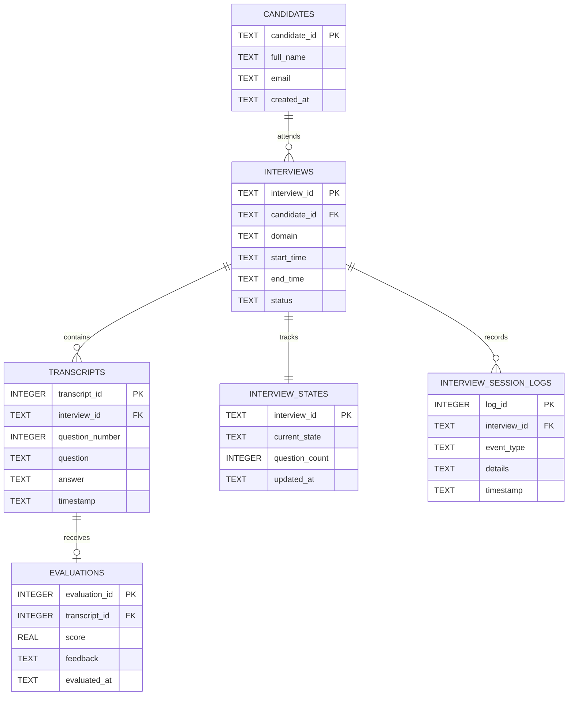

# ER Diagram

```mermaid
erDiagram
    CANDIDATES ||--o{ INTERVIEWS : attends
    INTERVIEWS ||--o{ TRANSCRIPTS : contains
    TRANSCRIPTS ||--o| EVALUATIONS : receives
    INTERVIEWS ||--|| INTERVIEW_STATES : tracks
    INTERVIEWS ||--o{ INTERVIEW_SESSION_LOGS : records

    CANDIDATES {
        TEXT candidate_id PK
        TEXT full_name
        TEXT email
        TEXT created_at
    }

    INTERVIEWS {
        TEXT interview_id PK
        TEXT candidate_id FK
        TEXT domain
        TEXT start_time
        TEXT end_time
        TEXT status
    }

    TRANSCRIPTS {
        INTEGER transcript_id PK
        TEXT interview_id FK
        INTEGER question_number
        TEXT question
        TEXT answer
        TEXT timestamp
    }

    EVALUATIONS {
        INTEGER evaluation_id PK
        INTEGER transcript_id FK
        REAL score
        TEXT feedback
        TEXT evaluated_at
    }

    INTERVIEW_STATES {
        TEXT interview_id PK
        TEXT current_state
        INTEGER question_count
        TEXT updated_at
    }

    INTERVIEW_SESSION_LOGS {
        INTEGER log_id PK
        TEXT interview_id FK
        TEXT event_type
        TEXT details
        TEXT timestamp
    }
```
